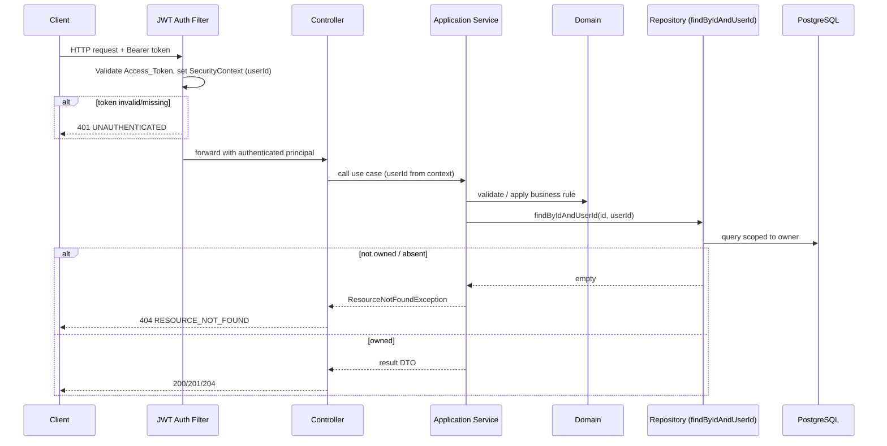
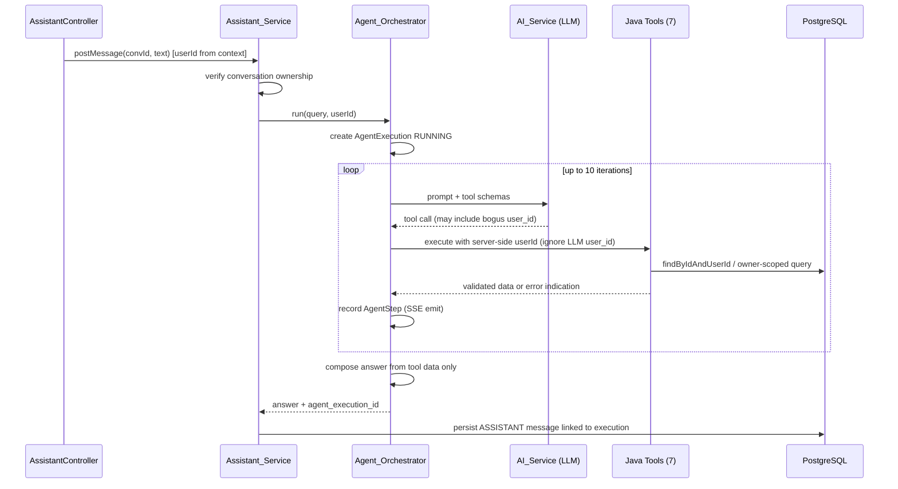
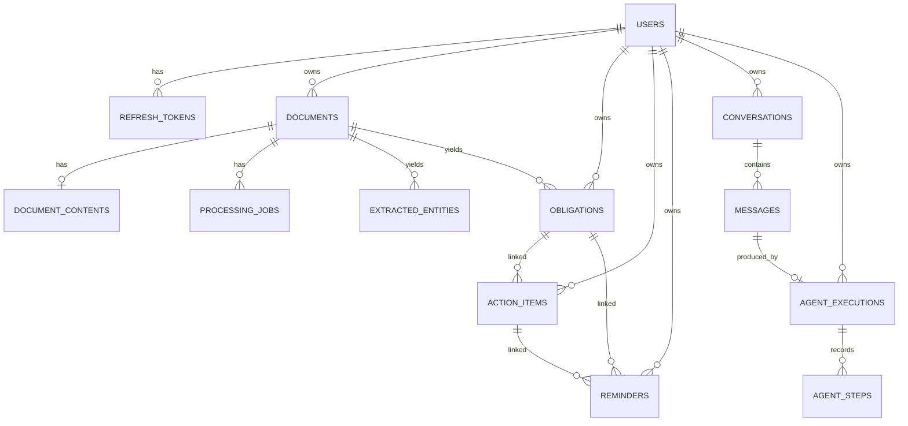

# Design Document

## Overview

LifeAdmin AI is a modular-monolith backend built with Java 21, Spring Boot, Spring AI, PostgreSQL, Flyway, Spring Data JPA, and Spring Security. It turns unstructured documents (invoices, warranties, insurance policies, rental agreements, etc.) into structured, actionable data (extracted entities, obligations, action items, reminders) and lets users interact with a natural-language AI assistant grounded in their own data.

The whole design is governed by one principle: **"AI proposes. Software validates. Users control."**

- The **LLM** handles understanding, extraction, classification, reasoning, planning, natural-language generation, and tool selection.
- The **Java application** owns authentication, authorization, validation, database access, transactions, business rules, persistence, consistency, idempotency, security, and auditability.
- The LLM is **never** a trusted component. It **never** receives unrestricted DB access and **never** performs DB writes. Every AI-proposed value passes through Java validation before persistence, and every tool the LLM can call enforces ownership and authorization server-side.

This document covers the MUST-BUILD scope (Requirements 1–35). Optional requirements (36–38: PGVector/RAG, email delivery, Redis, OCR, cloud storage, advanced rate limiting) are explicitly designed for as extension points but not implemented.

### Key Design Decisions

| Decision | Rationale |
|---|---|
| Modular monolith with strict dependency direction | Enforces separation of concerns and keeps the domain free of framework/provider SDKs (Req 22.5, 31.4), while avoiding distributed-system complexity for a 3-week scope. |
| Database-backed processing jobs (not in-memory queue) | Uploads return quickly (202) and processing survives restarts via job recovery (Req 11.1, 11.4). |
| AI calls outside DB transactions | Prevents holding DB connections/locks during slow network I/O; follows read→commit→call AI→validate→transaction→persist→commit (Req 13.4). |
| Ownership validation via `findByIdAndUserId` semantics | Cross-user access is indistinguishable from "not found", preventing enumeration and enforcing isolation uniformly (Req 6). |
| Dedup identity + DB unique constraint | Application-level dedup plus a database uniqueness constraint as the final guarantee against duplicate obligations on reprocess (Req 17). |
| Server-side identity binding for tools | The authenticated identity comes from the security context, never from LLM-supplied parameters, defeating prompt-injection privilege escalation (Req 24.4, 24.5, 26). |
| Provider abstraction (`AiClient` port) | Domain and application layers never depend on Ollama/OpenAI/Gemini SDKs; provider is swapped by configuration (Req 22). |

## Architecture

### Layered Dependency Direction

The system enforces a single, strict dependency direction. Higher layers depend only on the layer directly beneath them; the domain depends on nothing framework- or provider-specific.

```
Controller  →  Application Service  →  Domain  →  Repository Interface  →  Infrastructure
   (api)          (application)       (domain)        (repository/port)      (infrastructure)
```

- **Controller (api)**: HTTP concerns only — request binding, DTO mapping, status codes. No business logic, no direct repository access (Req 31.4).
- **Application Service**: Use-case orchestration, transaction boundaries, authorization checks, calls to domain services and repository ports.
- **Domain**: Entities, value objects, enums, and pure domain rules (validation, normalization, threshold classification, dedup identity). No Spring, no JPA annotations leaking business rules, no provider SDKs.
- **Repository Interface (port)**: Interfaces expressing persistence needs in domain terms (e.g., `findByIdAndUserId`).
- **Infrastructure**: Spring Data JPA adapters, storage adapters, AI provider adapters, notification adapters, security implementations.

### Module Map (packages under `com.lifeadmin`)

```
com.lifeadmin
├── common              # cross-cutting: error model, exception handling, security context, base entities, config
│   ├── error           # ApiError, ErrorCode, GlobalExceptionHandler
│   ├── security        # JWT filter, SecurityContext accessor, CurrentUser resolver
│   ├── persistence     # BaseEntity (UUID id, version, created_at, updated_at)
│   └── config          # CORS, OpenAPI, TaskExecutor, AI provider selection
├── auth                # registration, login, refresh/rotation, logout
├── user                # profile retrieval/update
├── document            # upload, list, retrieve, download, delete, reprocess
├── storage             # Storage_Service abstraction (filesystem impl)
├── processing          # Processing_Service: job orchestration, recovery, retry/backoff/dead-letter
├── extraction          # text extraction (PDFBox/Tika/plain), normalization, entity persistence
├── obligation          # obligation detection (thresholds), idempotency, management
├── action              # action item management
├── reminder            # reminder management + scheduling
├── notification        # Notification_Service (in-app delivery)
├── dashboard           # dashboard summary
├── assistant           # conversations, messages
├── agent               # Agent_Orchestrator, agent execution/step tracking, SSE, tools
└── ai                  # AI_Service: AiClient port, provider adapters, structured output, ai_invocations auditing
```

Each functional module follows the same internal shape:

```
com.lifeadmin.<module>
├── api            # RestController + request/response DTOs
├── application    # @Service application services (transaction + orchestration)
├── domain         # entities, value objects, enums, pure domain services
├── repository     # Spring Data JPA repository interfaces (ports)
└── infrastructure # adapters (only where an external system is involved)
```

### Request Processing Flow (synchronous REST)



### Asynchronous Document Processing Flow

```mermaid
sequenceDiagram
    participant Ctrl as DocumentController
    participant DocSvc as Document_Service
    participant Store as Storage_Service
    participant Job as Processing_Job (DB)
    participant Proc as Processing_Service (TaskExecutor)
    participant Ext as Extraction_Service
    participant AI as AI_Service
    participant Obl as Obligation_Service

    Ctrl->>DocSvc: upload(file)
    DocSvc->>DocSvc: validate type/size/signature/empty, checksum, dedup
    DocSvc->>Store: store(bytes) → storage_key
    DocSvc->>Job: create PENDING / QUEUED
    DocSvc-->>Ctrl: 202 Accepted
    Note over Proc: async, non-blocking
    Proc->>Job: status RUNNING
    Proc->>Ext: TEXT_EXTRACTION → TEXT_NORMALIZATION (persist document_contents)
    Proc->>Proc: commit read tx
    Proc->>AI: AI_ANALYSIS (network call, NO open tx)
    AI-->>Proc: DocumentAnalysisResult
    Proc->>Proc: validate result (Java rules)
    alt invalid or transient failure
        Proc->>Job: RETRY_PENDING (+backoff) or FAILED or DEAD_LETTER
    else valid
        Proc->>Ext: ENTITY_PERSISTENCE (begin tx)
        Proc->>Obl: OBLIGATION_PERSISTENCE (thresholds + dedup)
        Proc->>Job: COMPLETED; Document PROCESSED
    end
```

### Agent Orchestration Flow (assistant)



## Components and Interfaces

This section describes each module's responsibilities and its primary interfaces. Method signatures are illustrative; DTOs are omitted for brevity unless behaviorally significant.

### common

- **BaseEntity**: `UUID id`, `long version` (optimistic locking, Req 28), `Instant createdAt`, `Instant updatedAt` (Req 30.3, 30.4).
- **CurrentUserProvider**: reads authenticated `UUID userId` from the Spring Security context. This is the single source of truth for identity used across all services and tools.
- **GlobalExceptionHandler** (`@RestControllerAdvice`): maps exceptions to the standardized error body (Req 29).
- **ErrorCode** (enum): `VALIDATION_ERROR`, `EMAIL_ALREADY_EXISTS`, `INVALID_CREDENTIALS`, `ACCOUNT_NOT_ACTIVE`, `INVALID_REFRESH_TOKEN`, `UNAUTHENTICATED`, `RESOURCE_NOT_FOUND`, `UNSUPPORTED_FILE_TYPE`, `FILE_TOO_LARGE`, `EMPTY_FILE`, `CONTENT_TYPE_MISMATCH`, `DUPLICATE_DOCUMENT`, `FILE_NOT_FOUND`, `STALE_UPDATE`, `AI_PROVIDER_UNAVAILABLE`.

### auth (Auth_Service)

Responsibilities: registration, login, token refresh with rotation, logout.

- `AuthService.register(RegisterCommand)` → validates email format/length, password policy, first_name, IANA timezone; ensures email uniqueness; BCrypt-hashes the password; creates user ACTIVE, email_verified=false, UUID PK (Req 1, 2).
- `AuthService.login(LoginCommand)` → verifies credentials against BCrypt hash; checks status ACTIVE; issues Access_Token + Refresh_Token; sets last_login_at; stores hashed refresh token (Req 2).
- `AuthService.refresh(rawRefreshToken)` → validates hash/expiry/revocation; issues new pair; revokes old token (rotation) (Req 3).
- `AuthService.logout(rawRefreshToken)` → revokes token; idempotent for already-revoked/unknown (Req 4).
- **Domain helpers (pure)**: `PasswordPolicy.isValid(String)`, `EmailFormat.isValid(String)`, `TimezoneValidator.isValid(String)`.
- **Ports**: `UserRepository`, `RefreshTokenRepository`; `PasswordHasher` (BCrypt adapter), `TokenService` (JWT issue/verify), `TokenHasher` (refresh-token hashing).

### user (User_Service)

- `UserService.getProfile(userId)` and `UserService.updateProfile(userId, UpdateProfileCommand)` — restricted to the authenticated user; validates timezone on update (Req 5).

### document (Document_Service)

- `DocumentService.upload(userId, UploadedFile)` → runs the upload validation pipeline (below), computes SHA-256, stores via Storage_Service, creates Document (UPLOADED, document_type UNKNOWN) and Processing_Job (PENDING/QUEUED), returns 202 (Req 7).
- `DocumentService.list(userId, filter, pageable)` → owner-scoped, paginated, filter by document_type/processing_status (Req 8).
- `DocumentService.get(userId, docId)`, `download(userId, docId)`, `delete(userId, docId)`, `reprocess(userId, docId)` (Req 8, 35, 9, 10).
- **Upload validation pipeline (pure `UploadValidator`)**, in order: reject empty (EMPTY_FILE) → reject unsupported content type (UNSUPPORTED_FILE_TYPE) → reject size over max (FILE_TOO_LARGE) → reject magic-byte mismatch (CONTENT_TYPE_MISMATCH) → checksum + per-user dedup (DUPLICATE_DOCUMENT).
- **FilenameSanitizer (pure)**: strips path separators and control characters, truncates to 255 chars (Req 7.2).

### storage (Storage_Service)

- Port `StorageService`: `String store(bytes, key)`, `Optional<Resource> retrieve(storageKey)`, `void delete(storageKey)`. Filesystem adapter under `FILE_STORAGE_PATH`; missing file surfaces FILE_NOT_FOUND (Req 35.3). Cloud storage is a future adapter behind the same port (Req 38.3).

### processing (Processing_Service)

- `ProcessingOrchestrator.execute(jobId)` — runs on a Spring `TaskExecutor`; advances stages TEXT_EXTRACTION → TEXT_NORMALIZATION → AI_ANALYSIS → ENTITY_PERSISTENCE → OBLIGATION_PERSISTENCE; sets COMPLETED and Document PROCESSED (Req 11).
- `JobRecoveryService` (`ApplicationReadyEvent`): re-queues jobs left RUNNING or RETRY_PENDING (Req 11.4).
- **RetryPolicy (pure)**: classifies failures as transient (LLM timeout, HTTP 429, temporary provider/storage failure → RETRY_PENDING with exponential backoff + jitter) vs permanent (unsupported/corrupted/invalid input → FAILED); dead-letters when attempt_count reaches max_attempts (Req 16).
- **BackoffCalculator (pure)**: `Duration nextDelay(attempt, base, cap, jitter)` — monotonic non-decreasing base delay (pre-jitter), capped.

### extraction (Extraction_Service)

- `ExtractionService.extract(document)` → PDF via PDFBox (fallback Tika) → PDFBOX/TIKA; plain text → PLAIN_TEXT; persists document_contents (raw_text, normalized_text, character_count, extracted_at); empty text → FAILED/EXTRACTION_EMPTY, no retry (Req 12).
- `ExtractionService.persistEntities(documentId, result)` → validates each entity_type against the allowed set (rejects unknown), stores confidence in [0,1]; on reprocess replaces prior entities (Req 14).
- **TextNormalizer (pure)**: deterministic normalization used for both content and downstream reference normalization.

### obligation (Obligation_Service)

- `ObligationService.createFromAnalysis(userId, documentId, result)` → applies threshold classification and idempotency (below) (Req 15, 17).
- Management: `list/get/confirm/dismiss/complete/update`, owner-scoped (Req 18).
- **ConfidenceClassifier (pure)**: given confidence and configured thresholds (high default 0.90, review default 0.70): `>= high` → persist DETECTED, requires_confirmation=false; `>= review and < high` → persist DETECTED, requires_confirmation=true; `< review` → do not persist, emit audit entry (Req 15.1–15.4).
- **DedupIdentity (pure value object)**: `(documentId, obligationType, normalizedDueDate, normalizedReference)` where normalizedDueDate truncates to calendar day and normalizedReference trims + lowercases (Req 17.2). A DB unique constraint on this tuple is the final guard; constraint violations are treated as successful dedup, leaving existing (including confirmed/dismissed) obligations unchanged (Req 17.5, 17.6, 17.4).

### action (Action_Service)

- `create/list/complete/update/delete`, owner-scoped; created items are TODO/USER; linking an obligation_id verifies obligation ownership first (Req 19).

### reminder (Reminder_Service) + notification (Notification_Service)

- `ReminderService.create` requires at least one of obligation_id/action_item_id owned by the user; IN_APP reminders persist SCHEDULED (Req 20.1, 20.2). `list/update/delete` owner-scoped.
- `NotificationScheduler` (`@Scheduled`): scans due SCHEDULED IN_APP reminders, marks SENT + sent_at (Req 20.5). Email is a future channel (Req 37).

### dashboard (Dashboard_Service)

- `DashboardService.summary(userId)` → counts and upcoming items computed exclusively from the user's own data: upcoming obligations, obligations requiring confirmation, open action items, scheduled reminders (Req 21).

### assistant (Assistant_Service)

- `createConversation/listConversations` owner-scoped (Req 23.1, 23.2).
- `postMessage(userId, convId, text)` → verifies ownership; persists USER message; invokes Agent_Orchestrator; persists ASSISTANT reply linked to agent_execution_id (Req 23.3–23.5).

### agent (Agent_Orchestrator)

- `AgentOrchestrator.run(userId, query)` → creates AgentExecution RUNNING (records model_provider/model_name); drives Spring AI tool-calling loop (≤10 iterations); records each AgentStep; composes the answer only from tool-returned data; on completion records tokens and COMPLETED, on failure FAILED with failure_code/message (Req 24, 25).
- **The seven tools** (Req 24.1): `searchDocuments`, `getDocument`, `searchObligations`, `getUpcomingObligations`, `searchActions`, `getUpcomingActions`, `searchDocumentContent`. Each tool:
  - Executes in Java (LLM never touches the DB) (Req 24.2, 24.8).
  - Binds identity to the server-side authenticated `userId`, ignoring any LLM-supplied `user_id` (Req 24.4, 24.5, 26).
  - Validates auth/ownership/input; on failure returns no data + an error indication (Req 24.3, 26.3).
- `IterationGuard`: hard stop at 10 iterations with an error indication (Req 24.7).
- **SSE**: `AgentEventController.stream(executionId)` streams AgentStep updates for owner-owned executions; non-owned → 404 (Req 25.5, 25.6).

### ai (AI_Service)

- Port `AiClient`: `DocumentAnalysisResult analyze(String text, PromptContext)` (structured output), `AgentTurn chat(ChatContext, List<ToolSpec>)` (tool-calling). Provider adapters: `OllamaAiClient`, `OpenAiAiClient`/`GeminiAiClient`, selected by `AI_PROVIDER` (Req 22.1–22.3). Unreachable provider → `AiProviderUnavailableException` (Req 22.4).
- `AiInvocationAuditor`: records ai_invocations (operation_type, provider, model, prompt_version, status, latency_ms, tokens when available); never stores full prompt text by default; failure/timeout/rate-limit statuses recorded (Req 27).
- The **domain layer never imports a provider SDK** (Req 22.5); all provider types live in `ai.infrastructure`.

## Data Models

All primary entities extend BaseEntity: `UUID id` (Req 30.3), `long version` (Req 28.1), `Instant createdAt`, `Instant updatedAt` (Req 30.4). All timestamps are TIMESTAMPTZ ↔ `Instant`. Schema is managed by Flyway; Hibernate `ddl-auto=validate` (Req 30.1, 30.2).



### Core Entities

- **User**: `id`, `email` (unique, ≤320), `password_hash` (BCrypt), `first_name`, `last_name?`, `timezone` (IANA), `status` (ACTIVE|LOCKED|DISABLED), `email_verified`, `last_login_at?`. Plaintext password never stored/returned (Req 1, 2).
- **RefreshToken**: `id`, `user_id` (FK), `token_hash`, `expires_at`, `revoked`, `revoked_at?`. Raw token never stored (Req 2.5, 3.4).
- **Document**: `id`, `user_id` (FK), `original_file_name` (sanitized, ≤255), `stored_file_name`, `storage_key`, `content_type`, `file_extension`, `file_size_bytes`, `checksum_sha256`, `document_type` (UNKNOWN until processed), `processing_status` (UPLOADED|QUEUED|PROCESSING|PROCESSED|FAILED), `processing_error_code?`, `uploaded_at`. Unique `(user_id, checksum_sha256)` for dedup (Req 7).
- **DocumentContents**: `id`, `document_id` (FK), `raw_text`, `normalized_text`, `character_count`, `extraction_method` (PDFBOX|TIKA|PLAIN_TEXT|OCR|MULTIMODAL_AI), `extracted_at` (Req 12).
- **ProcessingJob**: `id`, `document_id` (FK), `status` (PENDING|RUNNING|COMPLETED|FAILED|RETRY_PENDING|DEAD_LETTER), `current_stage` (QUEUED|TEXT_EXTRACTION|TEXT_NORMALIZATION|AI_ANALYSIS|ENTITY_PERSISTENCE|OBLIGATION_PERSISTENCE|COMPLETED), `attempt_count`, `max_attempts`, `next_retry_at?`, `error_code?`, `error_message?`, `completed_at?` (Req 11, 16).
- **ExtractedEntity**: `id`, `document_id` (FK), `entity_type` (allowed set), `entity_value`, `normalized_value`, `confidence` (0–1), `extraction_method`, `ai_model`, `prompt_version` (Req 14).
- **Obligation**: `id`, `user_id` (FK), `document_id?` (FK), `type`, `title`, `due_date?`, `priority`, `confidence`, `source_type` (AI|USER), `status` (DETECTED|CONFIRMED|DISMISSED|COMPLETED), `requires_confirmation`, `confirmed_at?`, `dismissed_at?`, `completed_at?`, plus dedup columns `normalized_due_date?`, `normalized_reference`. Unique `(document_id, type, normalized_due_date, normalized_reference)` (Req 15, 17).
- **ActionItem**: `id`, `user_id` (FK), `obligation_id?` (FK), `title`, `priority`, `status` (TODO|COMPLETED), `source_type` (USER|AI), `completed_at?` (Req 19).
- **Reminder**: `id`, `user_id` (FK), `obligation_id?` (FK), `action_item_id?` (FK), `remind_at`, `channel` (IN_APP|EMAIL), `status` (SCHEDULED|SENT|FAILED), `sent_at?`, `failure_reason?` (Req 20).
- **Conversation**: `id`, `user_id` (FK), `status` (ACTIVE|ARCHIVED) (Req 23).
- **Message**: `id`, `conversation_id` (FK), `role` (USER|ASSISTANT), `content`, `agent_execution_id?` (FK) (Req 23).
- **AgentExecution**: `id`, `user_id` (FK), `status` (RUNNING|COMPLETED|FAILED), `model_provider`, `model_name`, `input_tokens?`, `output_tokens?`, `failure_code?`, `failure_message?`, `completed_at?` (Req 25).
- **AgentStep**: `id`, `agent_execution_id` (FK), `step_number`, `step_type`, `name`, `status`, `tool_name?`, `input_summary?`, `output_summary?` (Req 25.2).
- **AiInvocation**: `id`, `operation_type`, `provider`, `model`, `prompt_version`, `status` (SUCCESS|FAILED|TIMEOUT|RATE_LIMITED), `latency_ms`, `input_tokens?`, `output_tokens?`, `error_code?`. No full prompt text (Req 27).

### DocumentAnalysisResult (AI structured output, transient — validated before persistence)

`documentType` (String), `confidence` (0–1), `entities[]` (`entityType`, `entityValue`, `normalizedValue?`, `confidence`), `obligations[]` (`type`, `title`, `dueDate?`, `priority?`, `reference?`, `confidence`). This object is produced by the LLM and MUST pass Java Bean Validation + domain rules before any persistence (Req 13.2, 13.3).
